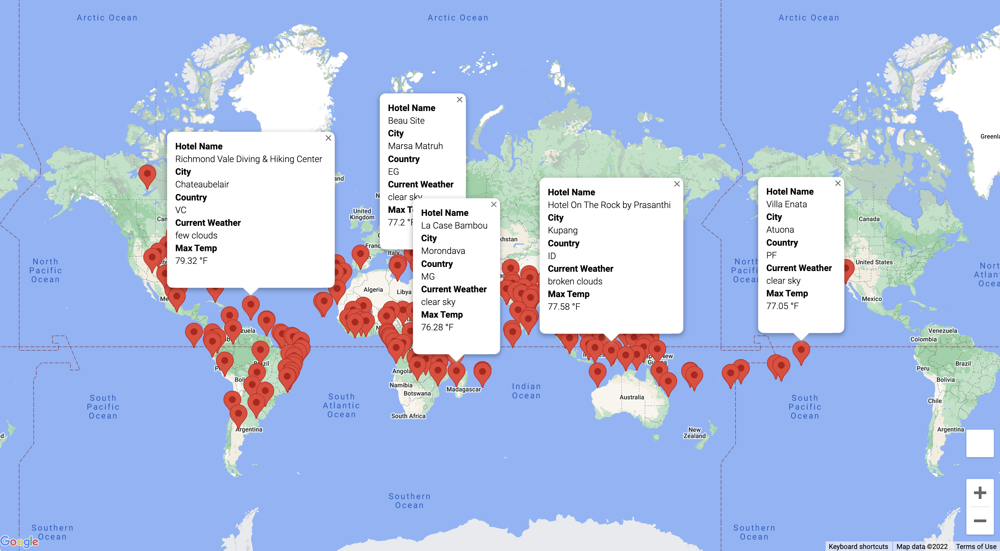
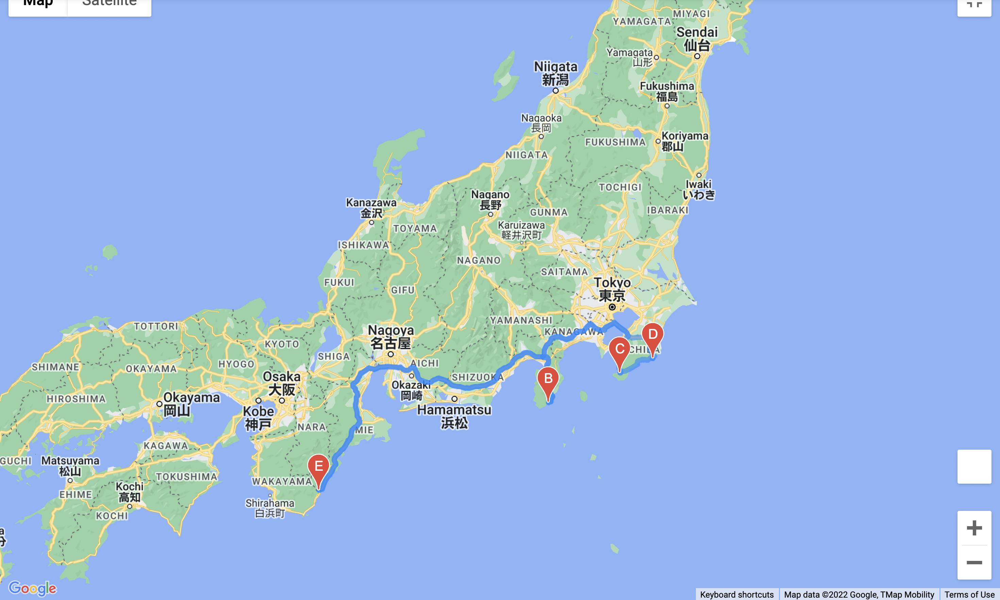

# World Weather Analysis

## Overview

***Background***

 

***Purpose***

## Resources 
- Data Source: 
- Software: Python 3.9.12, Anaconda 4.14.0, Jupyter Notebook 6.4.8 , Pandas 1.4.2 , Matplotlib 3.5.1

## Results: 

### Retrieve Weather Data 
Screenshot uploaded of weather data here 

### Create a Customer Travel Destination 

### Create a Travel Itinerary Map 

## Summary

