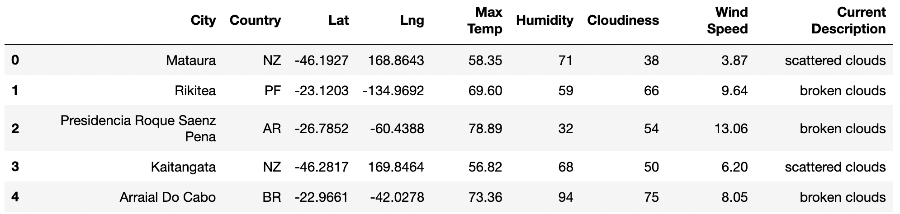

# World Weather Analysis

## Overview

***Background***
As part of the company PLANMYTRIP, we were tasked to collect and present data to customers on a search page based on where they would want to travel. This travel site helps find their ideal vacation location based on weather, hotels/lodging, and will also map out their destinations itinerary. In order to perform these tasks, we have to know how to request weather data from the OpenWeatherMap API, put the weather information into a Pandas data frame, create scatter plots using Matplotlib, and find the relationship between weather variables and location using linear regression.

***Purpose***
The purpose of this challenge is to add weather description to the weather data. We will also create input statements for customers to input their weather preferences to find potential travel destinations and hotels. Lastly, using the Google Maps Directions API, we will create a travel route between the cities of choice. 

## Resources 
- Data Source: CitiPy module, OpenWeatherMap API, Gmaps (Jupyter plugin), Google Maps and Places API, Google Maps Directions API
- Software: Python 3.9.12, Anaconda 4.14.0, Jupyter Notebook 6.4.8 , Pandas 1.4.2 , Matplotlib 3.5.1

## Results and Summaries
To fulfill the purpose of this challenge, we had to create three different analyses: Retrieve Weather Data, Create a Customer Travel Destinations Map, and Create a Travel Itinerary Map.

### Retrieve Weather Data 
We first had to generate 2,000 random latitudes and longitudes to retrieve the nearest city (using the CitiPy module) and use OpenWeatherMap's API to request city weather data (Latitude, Longitude, Maximum Temperature, Percent Humidity, Percent Cloudiness, Wind Speed, and Weather Description. After recieving the information needed, we have to create a new DataFrame and save it as a csv file for further analysis. See the beginning of the dataframe created:

### Create a Customer Travel Destination 
After retrieving weather data from the random latitude and longitude combinations, we created input boxes for customers to enter their weather preferences (minimum and maximum temperature). After narrowing down the cities generated using these preferences, we found hotels that were within a 5000 meter radius using Google Maps API Nearby Search. Lastly, we added the hotel destinations as markers on our map using the Gmaps plugin from Jupyter. 

### Create a Travel Itinerary Map 
In our third analysis, we used the Google Directions API to create a travel itinerary that shows the route between four cities chosen from the possible hotel destinations based on customer's weather preferences. In this example, the cities of Japan were chosen (Shingu, Shimoda, Tateyama, and Katsuura). From the Google Maps Directions API, we were able to create a route of travel with a printed itinerary. 

Lastly, we added the hotel name, city, country, weather description and max temp to our info box pop-up marker. 

